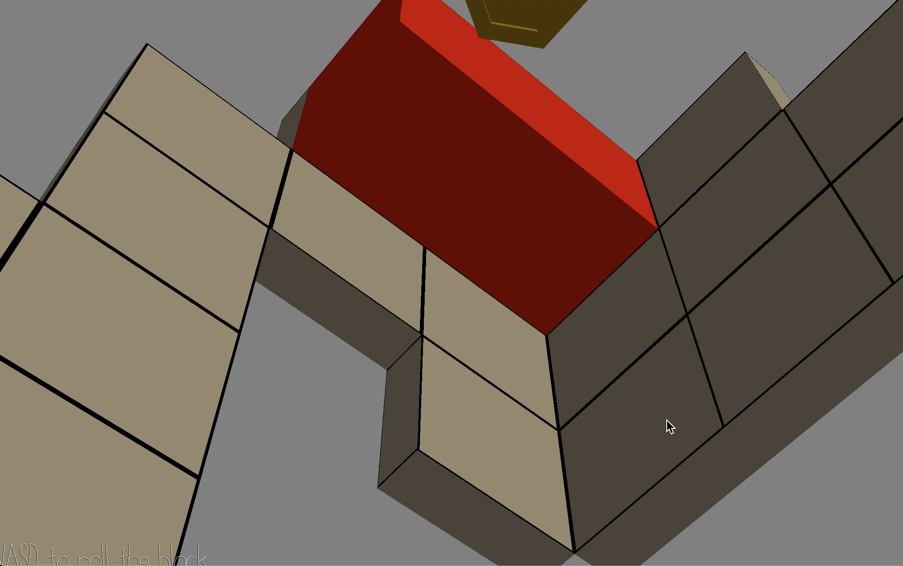

# Keep Rolling

Author: Xiaoqiao Xu, Zhengyang Xia, Zizhuo Lin

Design: Integrated several new mechanisms and dimensions into the classic sokoban game.

Screen Shot:

How To Play:

Use W, A, S and D to roll the rectangle to different directions. Collect all the coins in a level. Rolling towards a wall will change the direction of gravity.

[Game Play screen recording](https://drive.google.com/file/d/1xnTZlIxCHinT7PxHpHTzeQMquPf_MOht/view?usp=sharing)

Sources: N/A.

This game was built with [NEST](NEST.md).

